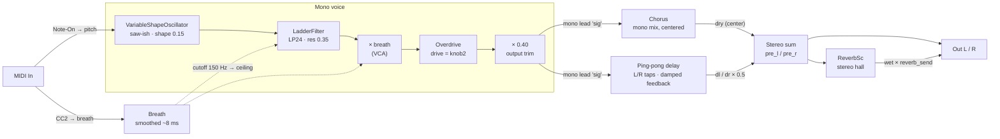

# v0 — Sound Chain Parameters

An EWI-style expressive lead: a saw-ish oscillator through a breath-driven
resonant lowpass, overdrive, chorus, a stereo ping-pong delay, and a hall
reverb. Breath (MIDI CC2) drives **both** filter brightness and amplitude
together — the core wind-controller feel. Pitch comes from MIDI note-on and
latches; the note falls silent when breath returns to zero.

This document lists **every parameter that can be mapped to a control**, for
defining the hardware interface. Sample rate is 48 kHz (`SetAudioBlockSize(48)`).

**Binding legend** (the "Now" column):
- `knob1` / `knob2` / `enc` / `sw1` — currently on a physical control
- `breath` / `MIDI` — driven by the wind controller
- `fixed` — hardcoded constant in [`main.cpp`](../main.cpp) (free to reassign)
- `unused` — DSP setter the code never calls (default value in effect)

Everything marked `fixed` or `unused` is a **free candidate** for a knob.
Only knob1, knob2, the encoder, and switch 1 are currently assigned, so **most
of these are unmapped.**

## Signal flow



The dry lead stays dead center (mono); all stereo width comes from the
ping-pong delay's L/R taps and the reverb.

## MIDI / breath control

| Parameter | Setter / var | Range | Value | Now | Notes |
|---|---|---|---|---|---|
| Note pitch | `note_frequency` | MIDI note → Hz | init 440 Hz | MIDI | Note-On, velocity > 0; latches, no note-off |
| Breath level | `breath_level` | 0.0–1.0 | CC2 / 127 | breath | Drives filter cutoff **and** VCA |
| Breath smoothing time | `breath_smoothing_...` | ms | 8 ms | fixed | One-pole glide on breath |

## Oscillator — `VariableShapeOscillator`

| Parameter | Setter | Range | Value | Now | Notes |
|---|---|---|---|---|---|
| Pitch (audible) | `SetSyncFreq` | Hz | note | MIDI | The slave/audible frequency |
| Waveshape | `SetWaveshape` | 0.0–1.0 | 0.15 | fixed | Triangle → saw morph |
| Pulse width | `SetPW` | 0.0–1.0 | 0.5 | fixed | |
| Sync enable | `SetSync` | bool | off | unused | If on, `SetFreq` sets the sync master |
| Sync master freq | `SetFreq` | Hz | — | unused | Only audible when sync is enabled (sync-sweep timbre) |

## Filter — `LadderFilter`

| Parameter | Setter | Range | Value | Now | Notes |
|---|---|---|---|---|---|
| Cutoff | `SetFreq` | ~20 Hz–sr/3 | dynamic | breath | `150 + breath² × (ceiling − 150)` Hz |
| Cutoff base floor | `150.f` const | Hz | 150 | fixed | Cutoff at zero breath |
| Cutoff ceiling | `kBrightness` | 0.0–1.0 | 0.66 → ≈4.15 kHz | fixed | `fmap(0.66, 400, 9000, EXP)` |
| Breath→cutoff curve | `smoothed_breath²` | — | squared | fixed | Exponent shaping the swell |
| Resonance | `SetRes` | 0.0–1.0 | 0.35 | fixed | Self-oscillates near 1.0 |
| Passband gain | `SetPassbandGain` | 0.0–1.0 | default | unused | Restores low-end lost at high res |
| Input drive | `SetInputDrive` | ≥ 0 | default | unused | Drives the filter's internal nonlinearity |
| Filter mode | `SetFilterMode` | enum | LP24 | fixed | LP/BP/HP × 12/24 dB — selector, not a knob |

## VCA (breath amplitude)

| Parameter | Where | Range | Value | Now | Notes |
|---|---|---|---|---|---|
| Amplitude | `sig *= smoothed_breath` | 0.0–1.0 | breath | breath | Applied **before** overdrive — soft = clean, hard = bite |
| Output trim | `kPlayLevel` | 0.0–1.0 | 0.40 | fixed | Makeup trim after the drive's gain |

## Overdrive — `Overdrive`

| Parameter | Setter | Range | Value | Now | Notes |
|---|---|---|---|---|---|
| Drive | `SetDrive` | 0.0–1.0 | knob2 | **knob2** | Soft-clip grit, post-VCA |

## Chorus — `Chorus`

### What it does

A chorus fattens one voice into an "ensemble" by mixing the dry signal with a
short, continuously **modulated delay** (~1–10 ms). An LFO wobbles the delay
time, which continuously pitch-shifts the delayed copy a tiny amount (Doppler);
the drifting copy beats against the dry signal, producing shimmer/thickness.
Same machinery as a flanger, but with a longer base delay and less feedback.

DaisySP's `Chorus` holds **two independent chorus engines** plus a per-engine
pan. Each sample runs both engines and mixes them into L/R:

```
for i in 0,1:  sigl += (1 - pan[i]) * engine[i];  sigr += pan[i] * engine[i]
sigl *= 0.5;   sigr *= 0.5
```

`Process()` returns **only the left** result; the right is read separately with
`GetRight()`. v0 now reads **both** `GetLeft()`/`GetRight()` into the L/R sum, and
**switch 1 (`button1`) toggles a mono/stereo preset** via `apply_chorus_mode()`
(reconfigured only on toggle, never per-sample). LED1 shows the mode (white =
mono, cyan = stereo) with brightness driven by breath.

### Parameters

Per-engine values are given as **mono / stereo**, the two presets switch 1
selects. `SetFeedback` is shared (0.2, both engines/modes).

| Parameter | Setter | Range | Mono / Stereo | Now | Notes |
|---|---|---|---|---|---|
| LFO frequency | `SetLfoFreq(l, r)` | Hz | 0.5 / 0.5 · 0.40 / 0.55 | sw1 preset | Different L/R rates decorrelate → width |
| LFO depth | `SetLfoDepth(l, r)` | 0.0–**0.93** | 0.35 / 0.35 · 0.35 / 0.30 | sw1 preset | Clamped at 0.93 internally; scales pitch wobble |
| Delay | `SetDelay(l, r)` | 0.0–1.0 → **0.1–8 ms** | 0.6 / 0.6 · 0.5 / 0.7 | sw1 preset | ⚠ Header docstring says "0.1–50 ms" — **wrong**; code is `0.1 + x·7.9` ms |
| Delay (ms) | `SetDelayMs` | 0.1–50 ms | — | unused | Direct ms alternative (50 ms = 2400-sample buffer cap) |
| Feedback | `SetFeedback` | 0.0–1.0 | 0.2 | fixed | Shared; higher → toward flanger |
| Pan | `SetPan(l, r)` | 0.0–1.0 each | 0.5 / 0.5 · 0.0 / 1.0 | sw1 preset | Mono centers both engines (L==R); stereo spreads hard L/R |

### Using pan + per-channel width for stereo

**Panning alone gives no width.** Both engines are initialized identically, so
with the default pans the mix collapses to mono:

```
L = 0.75·e + 0.25·e = e
R = 0.25·e + 0.75·e = e     →  L == R  →  centered, no width
```

Width requires the two channels to be **decorrelated**. The recipe, in order of
importance:

1. **Decorrelate the engines** — give them different LFO rates (and optionally
   depth/delay) with the `(l, r)` setters, e.g. `SetLfoFreq(0.40f, 0.55f)`.
   Their pitch wobbles drift out of step, so L and R carry different detunings.
2. **Pan them apart** — `SetPan(0.f, 1.f)` for maximum width (default
   0.25/0.75 is milder).
3. **Read both outputs** — route `GetLeft()`→L and `GetRight()`→R. Using only
   the mono `Process()` return discards the right channel and negates 1–2.

The pan mix is additive (no phase inversion), so it stays mono-compatible.

**Status in v0:** this is now wired. The audio loop reads `GetLeft()`/`GetRight()`,
and `apply_chorus_mode()` swaps between the mono preset (identical engines,
`SetPan(0.5, 0.5)` → L==R, dead center) and the stereo preset (decorrelated
rates/delays, `SetPan(0.0, 1.0)`). Switch 1 toggles it. Note that in mono the
lead stays centered and width still comes from the ping-pong delay and reverb;
stereo mode additionally spreads the *core* lead.

## Ping-pong delay — two `DelayLine` + `OnePole` damp

Several of these are plain `constexpr` in the code, not DSP setters, but are
equally mappable.

| Parameter | Setter / const | Range | Value | Now | Notes |
|---|---|---|---|---|---|
| Delay time | `SetDelay` / `kDelayMin..Max` | 0.04–0.75 s | knob1 | **knob1** | `fmap(knob1, .04, .75, EXP)`, square-law; glided |
| Default time | `kDelayTimeSec` | s | 0.409 | fixed | ~dotted-eighth at 110 BPM; startup seed |
| Time glide rate | `fonepole(... 0.0005)` | coeff | 0.0005 | fixed | Slew on delay-time changes |
| Max delay | `MAX_DELAY` | samples | 48000 (1 s) | fixed | SDRAM buffer size (compile-time cap) |
| Feedback | `kDelayFeedback` | 0.0–~1.0 | 0.4 | fixed | Repeat decay |
| Wet mix | `kDelayMix` | 0.0–1.0 | 0.5 | fixed | Level of the L/R taps |
| Feedback damping | `delay_damp.SetFrequency` | 0.0–0.497 | 0.08 (~3.8 kHz) | fixed | `OnePole` LP; darkens each repeat |
| Damp mode | `delay_damp.SetFilterMode` | LP/HP | LP | fixed | Selector |

## Reverb — `ReverbSc`

| Parameter | Setter / var | Range | Value | Now | Notes |
|---|---|---|---|---|---|
| Feedback (size) | `SetFeedback` | 0.0–1.0 | 0.85 | fixed | Tail length / room size |
| Damping LP | `SetLpFreq` | Hz | 7000 | fixed | Brightness of the tail |
| Reverb send | `reverb_send` | 0.0–1.0 | 0.75 | **enc** | Wet added to the dry sum |
| Send step | `kReverbStep` | — | 0.05 | fixed | Per-detent increment |

## Currently assigned physical controls

| Control | Target | Range / step |
|---|---|---|
| knob1 | Ping-pong delay time | 0.04–0.75 s (EXP) |
| knob2 | Overdrive drive | 0.0–1.0 |
| Encoder | Reverb send | 0–1, ±0.05 per detent |
| Switch 1 (button1) | Chorus mono/stereo toggle | latching, rising-edge |
| LED1 | Breath level; hue = chorus mode | brightness ∝ CC2; white = mono, cyan = stereo |
| LED2 | Reverb send (blue) | brightness ∝ send |

## Suggested free parameters to map next

Ranked by musical payoff for a lead like this — all currently `fixed`/`unused`:

1. **Filter resonance** (`SetRes`, 0–1) — the biggest timbre mover after cutoff.
2. **Cutoff ceiling / brightness** (`kBrightness`) — sets how bright full breath gets.
3. **Reverb size** (`SetFeedback`) and/or **delay feedback** (`kDelayFeedback`) — space/ambience.
4. **Delay wet mix** (`kDelayMix`) — dry/wet balance of the echoes.
5. **Chorus depth** (`SetLfoDepth`) or **rate** (`SetLfoFreq`) — thickness/movement (currently sw1-preset values; a knob would override the preset).
6. **Waveshape** (`SetWaveshape`) — saw↔triangle tone.
7. **Breath→cutoff curve / smoothing** — response feel of the whole instrument.
